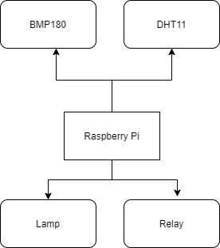

## About Project

This repository has  created for remote home control by mobile application. In the hardware, used raspberry pi zero.


## Structure of the System


<p align="center">

</p>


The data read on Raspberry Pi is send to Firebase Real Time Database and Firestore. The mobile application instantly reads and displays to the user. In addition, the mobile application can write the necessary commands to the Real Time Database for the control of lamps and electricity. While all these operations are performed, encryption algorithms are used for security purposes.


#### Hardware of System


  


- DHT11 is a digital sensor for measure temperature and humidity. It has a 4 pin, two of them power connections and one of them digital output pin.

- BMP180 designed to measure barometric pressure. İt has I2C communication protocol.


#### Embedded Software


- ###### Read data from DHT11:


Library for DHT11: [GitHub - adafruit/Adafruit_Python_DHT: Python library to read the DHT series of humidity and temperature sensors on a Raspberry Pi or Beaglebone Black.](https://github.com/adafruit/Adafruit_Python_DHT)


- ###### Read data from BMP180:


```python
 temp, pressure, altitude = bmpsensor.readBmp180()
    pressure = pressure*0.00750061683
    print("Temperature is ",temp)  
    print("Pressure is ",pressure) 
    print("Altitude is ",altitude) 
```

Library for BMP180: [GitHub - adafruit/Adafruit_Python_BMP: Python library for accessing the BMP series pressure and temperature sensors like the BMP085/BMP180 on a Raspberry Pi or Beaglebone Black.](https://github.com/adafruit/Adafruit_Python_BMP)


##### Encryption and  Decryption Data by Python


- ###### **AES** (Advanced Encryption Standard)

The algorithm described by AES is a symmetric-key algorithm, meaning the same key is used for both encrypting and decrypting the data.

```python
class AESEnc():
    def __init__(self):
        pass

    def encrypt(self, msg, key):
        encoded_string = msg.encode()
        raw = bytearray(encoded_string)
        key = key.encode()
        encryptor = AES.new(key, AES.MODE_ECB)
        encrypted_msg = base64.b64encode(encryptor.encrypt(pad(raw, 16)))
        return (encrypted_msg).decode()

    def decrypt(self, msg, key):
        key = key.encode()
        decryptor = AES.new(key, AES.MODE_ECB)
        decoded_decrypted_msg = decryptor.decrypt(base64.b64decode(msg))
        return unpad(decoded_decrypted_msg,16).decode()

```


- ###### RSA (Rivest–Shamir–Adleman) 

   It is an asymmetric cryptographic algorithm.


```python
ass RSAEnc():
    def __init__(self):
        pass

    def encrypt(self,msg):
        public_key = ""
        raw = msg.encode()
        public = base64.b64decode(public_key)
        encryptor = PKCS1_v1_5.new(RSA.importKey(public))
        encrypted_msg = encryptor.encrypt(raw)
        encoded_encrypted_msg = base64.b64encode(encrypted_msg)
        return (encoded_encrypted_msg).decode()

    def decrypt(self,msg):
        private_key = ""
        private = base64.b64decode(private_key)
        decryptor = PKCS1_v1_5.new(RSA.importKey(private))
        decoded_encrypted_msg = base64.b64decode(msg)
        decoded_decrypted_msg = decryptor.decrypt(decoded_encrypted_msg, 'sentinel')
        return decoded_decrypted_msg.decode()

```


#### Software of System

User have to register for access the system. Used Firebase for user registration, email authentication and login process control.

###### Register 

```kotlin
private fun registerNewUser(mail: String, password: String) {
        progressBarVisible(true)
        auth = Firebase.auth
        auth.createUserWithEmailAndPassword(mail, password)
                .addOnCompleteListener { p0 ->
                    if (p0.isSuccessful) {
                        Toast.makeText(this@RegisterActivity,"Sign Up with Succesfuly",Toast.LENGTH_SHORT)
                        .show()
                        sendVerifiedMail()
                       
                    } else {
                        Toast.makeText(this@RegisterActivity,"Error occured, While signing up user " + p0.exception?.message,
                                Toast.LENGTH_SHORT
                        ).show()
                    }
                }      
    }
```


###### Login


```kotlin
 if (email.text.isNotEmpty() && password.text.isNotEmpty()) {
                progressBarVisible(true)
                FirebaseAuth.getInstance()
                    .signInWithEmailAndPassword(email.text.toString(), password.text.toString())
                    .addOnCompleteListener { p0 ->
                        if (p0.isSuccessful) {
                            progressBarVisible(false)
                        } else {
                            Toast.makeText(
                                this@LoginActivity,
                                "Error occurred, While user logging  " + p0.exception?.message,
                                Toast.LENGTH_SHORT
                            ).show()
                            progressBarVisible(false)
                        }
                    }
            } else {
                Toast.makeText(this@LoginActivity, "Please fill empty fields", Toast.LENGTH_SHORT)
                    .show()
            }
```


###### Main 


User can see instant data easily in the main page.


- Read and show data:

```kotlin
  override fun onDataChange(snapshot: DataSnapshot) {
                for (singleSnapshot in snapshot!!.children) {
                    val readedData = singleSnapshot.getValue(Sensor1::class.java)                    
                    if (progressBar.isVisible) {
                        progressBar.visibility = View.INVISIBLE
                    }

                    val value1 = SecurityData.decryptData(readedData?.Sensor1.toString())
                    val value2 = SecurityData.decryptData(readedData?.Sensor2.toString())
                    val value3 = SecurityData.decryptData(readedData?.Sensor3.toString())

                    txtS1.text = value1.plus("°C")
                    txtS2.text = value2
                    txtS3.text = value3

                    val valueList = ArrayList<SensorItem>()
                    valueList.add(
                            SensorItem(
                                    "Instant Temprature",
                                    value1
                            )
                    )
                    valueList.add(
                            SensorItem(
                                    "Instant Humudity",
                                    value2
                            )
                    )
                    valueList.add(
                            SensorItem(
                                    "Instant Pressure",
                                    value3
                            )
                    )

                    initViewPager(valueList)
                    Log.d("Tag", readedData.toString())
                }
            }
```


###### Dashboard

User can view daily, weekly and monthly data on table.


- Read all data from Firestore and show:


```kotlin
  fun readFirestore(minusDay: Long, type: TimeRange, sensorName: String) {
        entries = ArrayList<Entry>()
        val db = FirebaseFirestore.getInstance()
        var descriptionText = "DAYS"
        val currentDate = LocalDateTime.now().minusDays(minusDay)
        db.collection("sensor")
            .get()
            .addOnSuccessListener { result ->
                for (document in result) {

                    val date = LocalDateTime.parse(
                        document.id,
                        DateTimeFormatter.ofPattern("yyyy-MM-dd HH:mm:ss")
                    )
                    val day = date.dayOfMonth.toFloat()
                    val str = document.getDouble(sensorName)?.toFloat()
                    if (date.isAfter(currentDate)) {
                        when (type) {

                            TimeRange.DAY -> if (str != null) {
                                entries.add(Entry(date.hour.toFloat(), str.toFloat()))
                                descriptionText = "DAY"
                                System.out.println("Day:" + date.hour.toFloat() + ";" + str.toFloat())
                            }
                            TimeRange.WEEK -> if (str != null) {
                                entries.add(Entry(date.dayOfMonth.toFloat(), str.toFloat()))
                                descriptionText = "WEEK"
                                System.out.println("Week:" + date.dayOfMonth.toFloat() + ";" + str.toFloat())
                            }
                            TimeRange.MONTH -> if (str != null) {
                                entries.add(Entry(date.dayOfMonth.toFloat(), str.toFloat()))
                                descriptionText = "MONTHS"
                                System.out.println("Month:" + date.hour.toFloat() + ";" + str.toFloat())
                            }
                        }

                    }

                }
                setLine(descriptionText)
            }
            .addOnFailureListener { exception ->
                Log.w("Oku", "Error getting documents.", exception)
            }
    }
```


###### Control

User can control electricity and lamp.

- Send control commands to Real Time Database:

```kotlin

        llLamp1.setOnClickListener {
            if (controlValue[0] == "On") {
                controlValue[0] = "Off"
                database.child("mobile").child("controls").setValue(
                    Controls(
                        controlValue[3],
                        controlValue[4],
                        controlValue[5],
                        controlValue[0],
                        controlValue[1],
                        controlValue[2]
                    )
                )
                txtLamp1.text = "Off"
                llLamp1.background = ContextCompat.getDrawable(
                    this,
                    R.drawable.curved_background
                )
            } else {
                controlValue[0] = "On"
                database.child("mobile").child("controls").setValue(
                    Controls(
                        controlValue[3],
                        controlValue[4],
                        controlValue[5],
                        controlValue[0],
                        controlValue[1],
                        controlValue[2]
                    )
                )
                txtLamp1.text = "On"
                llLamp1.background =
                    ContextCompat.getDrawable(
                        this,
                        R.drawable.curved_background_clicked
                    )
            }
        }
```


##### Encryption and  Decryption Data by Kotlin


###### **AES** (Advanced Encryption Standard)

```kotlin
object AESEnc {

    private val encoder = Base64.getEncoder()
    private val decoder = Base64.getDecoder()

    private fun cipher(opmode: Int, secretKey: String): Cipher {
        if (secretKey.length != 32) throw RuntimeException("SecretKey length is not 32 chars")
        val c = Cipher.getInstance("AES")
        val sk = SecretKeySpec(secretKey.toByteArray(Charsets.UTF_8), "AES")
        val iv = IvParameterSpec(secretKey.substring(0, 16).toByteArray(Charsets.UTF_8))
        c.init(opmode, sk)
        return c
    }

    fun encrypt(str: String, secretKey: String): String {
        val encrypted = cipher(Cipher.ENCRYPT_MODE, secretKey).doFinal(str.toByteArray(Charsets.UTF_8))
        return String(encoder.encode(encrypted))
    }

    fun decrypt(str: String, secretKey: String): String {
        val byteStr = decoder.decode(str.toByteArray(Charsets.UTF_8))
        return String(cipher(Cipher.DECRYPT_MODE, secretKey).doFinal(byteStr))
    }
}
```


###### RSA (Rivest–Shamir–Adleman)


```kotlin
object RSAEnc {

    fun encryptRsa(data: String): String {
        val publicKey = generateRsaPublicKey()
        val cipher: Cipher = Cipher.getInstance("RSA/ECB/PKCS1Padding")
        cipher.init(Cipher.ENCRYPT_MODE, publicKey)
        val bytes = cipher.doFinal(data.toByteArray())

        return Base64.getEncoder().encodeToString(bytes)
    }

    fun decryptRsa(data: String): String {
        val privateKey = generateRsaPrivateKey()
        val cipher: Cipher = Cipher.getInstance("RSA/ECB/PKCS1Padding")
        cipher.init(Cipher.DECRYPT_MODE, privateKey)
        val encryptedData = Base64.getDecoder().decode(data);//data.toByteArray()
        val decodedData = cipher.doFinal(encryptedData)
        return String(decodedData)
    }

    fun generateRsaPublicKey(): Key {
        val Public =""

        val public: ByteArray = Base64.getDecoder().decode(Public)
        val keySpec = X509EncodedKeySpec(public)
        val keyFactory = KeyFactory.getInstance("RSA")
        return keyFactory.generatePublic(keySpec)
    }

    fun generateRsaPrivateKey(): Key {
        val privatekey = ""
        val private: ByteArray = Base64.getDecoder().decode(privatekey)
        val keySpec2 = PKCS8EncodedKeySpec(private)
        val keyFactory = KeyFactory.getInstance("RSA")
        return keyFactory.generatePrivate(keySpec2)
    }

}
```


### References:


